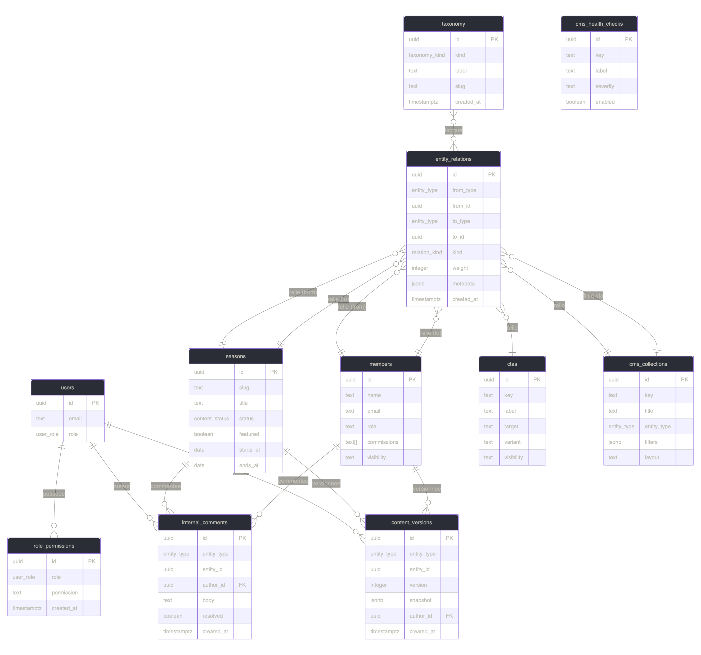

# Database — Manssuétude CMS

> Schémas SQL, tables et règles d'accès aux données.

---

## Fichiers SQL

Exécuter dans cet ordre dans le Supabase SQL Editor :

| Ordre | Fichier                     | Contenu             |
| ----- | --------------------------- | ------------------- |
| 1     | `supabase/schema.sql`       | Tables principales  |
| 2     | `supabase/storage.sql`      | Buckets médias      |
| 3     | `supabase/cms-advanced.sql` | Tables avancées CMS |

---

## Tables principales

| Table              | Description                        |
| ------------------ | ---------------------------------- |
| `users`            | Comptes utilisateurs               |
| `pages`            | Pages publiques du site            |
| `themes`           | Axes intellectuels                 |
| `productions`      | Contenus éditoriaux                |
| `activities`       | Activités collectives              |
| `projects`         | Initiatives structurées            |
| `resources`        | Fichiers et contenus réutilisables |
| `form_submissions` | Soumissions de formulaires         |
| `site_settings`    | Paramètres globaux du site         |

---

## Tables avancées

| Table               | Description                     |
| ------------------- | ------------------------------- |
| `seasons`           | Périodes ou saisons éditoriales |
| `members`           | Membres de l'association        |
| `entity_relations`  | Graphe générique de relations   |
| `taxonomy`          | Tags et taxonomie               |
| `ctas`              | Appels à l'action               |
| `cms_collections`   | Collections thématiques         |
| `content_versions`  | Versioning éditorial            |
| `internal_comments` | Commentaires internes           |
| `role_permissions`  | Matrice de permissions par rôle |
| `cms_health_checks` | Santé éditoriale                |

---

## Schéma des relations

---

## Règle d'accès

> Les requêtes Supabase doivent rester dans les repositories ou dans les fichiers d'intégration de bas niveau. Les composants et les pages publiques ne doivent pas contenir de logique au niveau des tables.
